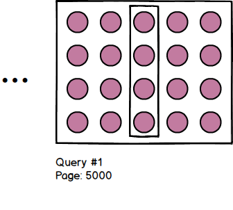
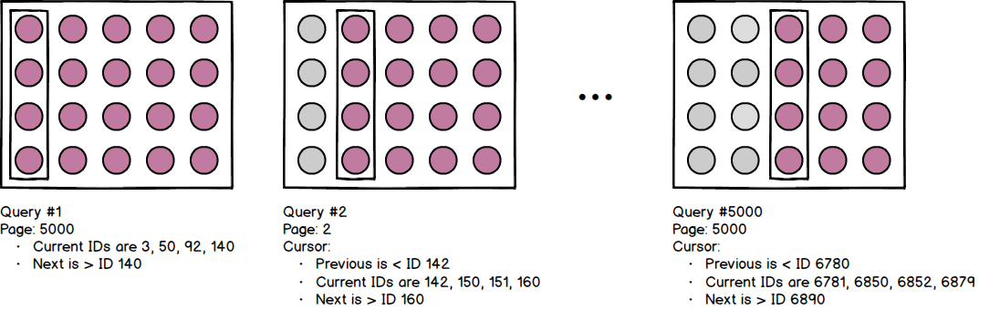

# Tutorial: Implement cursor pagination with GraphQL and PostgreSQL

In this tutorial you will create a GraphQL API with Node.js and PostgreSQL that implements [Relay-style](https://relay.dev/docs/en/graphql-server-specification.html#schema) cursor pagination.

* [ ] 0. Introduction to pagination with GraphQL
* [ ] 1. Set up your development environment
* [ ] 2. Create a PostgreSQL database
* [ ] 3. Create a GraphQL server in Node.js
* [ ] 4. Update the GraphQL schema and resolvers
* [ ] 5. Return paginated results from PostgreSQL
* [ ] 6. Test GraphQL cursor pagination

Alternatively, clone this repository and run `npm install` to install the required packages. Follow the steps in section #2 to set up a PostgreSQL database and update the following section in `index.js` with your PostgreSQL connection details:

```javascript    
const pool = new Pool({
    user: 'postgres',
    host: '127.0.0.1',
    database: 'magic-cards',
    password: 'yourpassword',
    port: 5432,
});
```

## 0. Introduction to pagination with GraphQL

There are two models for implementing pagination in a GraphQL API:

* **Limit/offset**: Specify how many objects to skip (offset) and how many objects to return (limit). For example, offset by 14 and limit by 4 to return objects 15 to 19 - or page 4 of the data set. You can jump from page 1 to page 5000 in your first query:

    

* **Cursor**: As you paginate through the data set, return a bookmark of your location (or 'cursor') that includes information about how to request the next and previous set of results. Cursors must be based on unique and sequential data, like an ID or a timestamp. For example, results 5 - 8 might have IDs 142, 150, 151, and 160, which means that results 9 - 12 must start with an ID greater than 160:

    

   You must paginate through the entire data set to reach page 5000 as there is no way to guess the first ID of the 5000th result set. Cursors are often returned to the client as an encoded value to indicate that the value cannot be guessed.

>Note: The pagination model you choose affects the backend implementation. Be aware that implementing cursor pagination in GraphQL does not mean that you have to use the underlying datastore's implementation of cursors. For example, this tutorial does not use PostgreSQL cursors.

Your choice of pagination model depends on your particular use case:

| **Pagination model**  	| **Pros**                                                                                                                                                                                                                                                                     	| **Cons**                                                                                                                                                                                                                                                                                                                                                                                	| **Use case**                                                                    	|
|-----------------------	|------------------------------------------------------------------------------------------------------------------------------------------------------------------------------------------------------------------------------------------------------------------------------	|-----------------------------------------------------------------------------------------------------------------------------------------------------------------------------------------------------------------------------------------------------------------------------------------------------------------------------------------------------------------------------------------	|---------------------------------------------------------------------------------	|
| Limit/offset          	| <ul> <li>Transparent and simple to implement</li> <li>Supports ordering results by any property - for example, total purchase cost.</li> </ul>                                                                                                                               	|  <ul> <li>Does not scale well for large data sets. Skipping 100,000 results to get 100,000 - 100,010 still requires you to traverse the first 100,000 records.</li> <li>Possible duplication if data is added while you are paginating - for example, a query that returns purchases ordered by total cost may return the same record multiple times as purchases are added.</li> </ul> 	| Shallow pagination through search results ordered by relevance.                 	|
| Cursor                	| <ul> <li>Scales for large data sets. When you use a bookmark to results 100,000 to 100,010, you do not need to traverse the first 100,000 results.</li> <li>Duplication is unlikely as results are ordered by a sequential property such as an ID or a timestamp.</li> </ul> 	| <ul>  <li>Only supports jumping to the next or previous page - you cannot jump to page 10,000.</li>  <li>Results must be ordered by a unique and sequential property - like ID. You cannot order by total purchase cost.  </ul>                                                                                                                                                         	| Infinite scroll through a large and dynamic data set, such as a comments feed. 	|

## 1. Set up your development environment

This tutorial requires you to install the following technologies:

* PostgreSQL (download from https://www.postgresql.org/download/)
* pgAdmin (download from: https://www.pgadmin.org/)
* Node.js (download from: https://nodejs.org/en/download/)

## 2. Create a PostgreSQL database

This tutorial uses a PostgreSQL database to store a list of Magic the Gathering playing cards. In this section you will:

* Create a PostgreSQL database with a single table named Card
* Populate the Card table with sample data

To create and popoulate a PostgreSQL database:

1. Log in to pgAdmin.
2. Right-click on the **Servers** > **PostgreSQL** > **Databases** node and click **Create** > **Database**...
3. Name your database *magic-cards* and click **Save**.
4. Right-click on the **magic-cards** database node and click **Query Tool...** .
5. To create the Card table, paste the following SQL script into the Query Editor and press F5 to run the script:

    ```sql
    SET statement_timeout = 0;
    SET lock_timeout = 0;
    SET idle_in_transaction_session_timeout = 0;
    SET client_encoding = 'UTF8';
    SET standard_conforming_strings = on;
    SELECT pg_catalog.set_config('search_path', '', false);
    SET check_function_bodies = false;
    SET xmloption = content;
    SET client_min_messages = warning;
    SET row_security = off;

    SET default_tablespace = '';

    SET default_table_access_method = heap;

    CREATE TABLE public."Card" (
        "CardID" bigint NOT NULL,
        "CardName" character varying(150) NOT NULL,
        "CardOracleText" text,
        "CardFlavourText" text,
        "CardManaCost" character varying(40),
        "SetID" bigint
    );

    ALTER TABLE public."Card" OWNER TO postgres;

    ALTER TABLE public."Card" ALTER COLUMN "CardID" ADD GENERATED ALWAYS AS IDENTITY (
        SEQUENCE NAME public."Card_CardID_seq"
        START WITH 1
        INCREMENT BY 1
        NO MINVALUE
        NO MAXVALUE
        CACHE 1
    );

    ALTER TABLE ONLY public."Card"
    ADD CONSTRAINT "Unique ID" UNIQUE ("CardID");

    CREATE INDEX "fki_FK_Card_Set" ON public."Card" USING btree ("SetID");
    ```

6. To populate the Card table with sample data, paste the following SQL script into the Query Editor and press F5 to run the script:

    > **TIP:** Run the query multiple times to insert duplicates (Magic the Gathering often prints new editions of a card). You will use this data later on in the tutorial.

    ```sql
    INSERT INTO public."Card" ("CardName", "CardOracleText", "CardFlavourText", "CardManaCost", "SetID") OVERRIDING SYSTEM VALUE VALUES ('Predatory Urge', NULL, NULL, NULL, NULL);
    INSERT INTO public."Card" ("CardName", "CardOracleText", "CardFlavourText", "CardManaCost", "SetID") OVERRIDING SYSTEM VALUE VALUES ('Consuming Aberration', 'Consuming Aberration''s power and toughness are each equal to the number of cards in your opponents'' graveyards. Whenever you cast a spell, each opponent reveals cards from the top of their library until they reveal a land card, then puts those cards into their graveyard.', NULL, NULL, NULL);
    INSERT INTO public."Card" ("CardName", "CardOracleText", "CardFlavourText", "CardManaCost", "SetID") OVERRIDING SYSTEM VALUE VALUES ('Verdant Fields', NULL, 'Jolrael tends the land so that the land will tend the beasts.', NULL, NULL);
    INSERT INTO public."Card" ("CardName", "CardOracleText", "CardFlavourText", "CardManaCost", "SetID") OVERRIDING SYSTEM VALUE VALUES ('Dragonlord Ojutai', 'Flying Dragonlord Ojutai has hexproof as long as it''s untapped. Whenever Dragonlord Ojutai deals combat damage to a player, look at the top three cards of your library. Put one of them into your hand and the rest on the bottom of your library in any order.', NULL, NULL, NULL);
    INSERT INTO public."Card" ("CardName", "CardOracleText", "CardFlavourText", "CardManaCost", "SetID") OVERRIDING SYSTEM VALUE VALUES ('Drudge Skeletons', NULL, 'The dead make good soldiers. They can''t disobey orders, never surrender, and don''t stop fighting when a random body part falls off." —Nevinyrral, Necromancer''s Handbook', NULL, NULL);
    INSERT INTO public."Card" ("CardName", "CardOracleText", "CardFlavourText", "CardManaCost", "SetID") OVERRIDING SYSTEM VALUE VALUES ('Coalition Victory', 'You win the game if you control a land of each basic land type and a creature of each color.', 'You can build a perfect machine out of imperfect parts.
        —Urza', '8', 2);
    INSERT INTO public."Card" ("CardName", "CardOracleText", "CardFlavourText", "CardManaCost", "SetID") OVERRIDING SYSTEM VALUE VALUES ('Sandsteppe Mastodon', 'When Sandsteppe Mastodon enters the battlefield, bolster 5. (Choose a creature with the least toughness among creatures you control and put five +1/+1 counters on it.)', '', '7', 2);
    ```

7. To see all cards, run the following SQL script:

    ```sql
    SELECT * FROM public."Card"
    ```

## 3. Create a GraphQL server in Node.js

This tutorial uses Node.js to run a GraphQL server using [express](https://www.npmjs.com/package/express) and [express-graphql](https://www.npmjs.com/package/express-graphql). In this section you will:

* Set up a Node.js project
* Install the [express](https://www.npmjs.com/package/express), [express-graphql](https://www.npmjs.com/package/express-graphql), and [pg](https://www.npmjs.com/package/pg]) modules
* Create a sample schema and a query resolver that returns sample data

To create and run a simple GraphQL server in Node.js:

1. Create a folder named *magic-cards* - for example, under \projects\magic-cards.
2. Open your terminal and run the following command in the **magic-cards** folder:

    `npm init`

3. Install the [express](https://www.npmjs.com/package/express), [express-graphql](https://www.npmjs.com/package/express-graphql), and [pg](https://www.npmjs.com/package/pg]) modules:

    `npm install express express-graphql pg --save`

4. Create an index.js file:

    > NOTE: This tutorial assumes that the primary entry point for your program is `index.js` (defined by the `main` parameter in `package.json`)

5. Paste the following scaffolding into `index.js`:

    ```javascript
    var express = require('express');
    var graphqlHTTP = require('express-graphql');
    var { buildSchema } = require('graphql');

    // Sample schema
    var schema = buildSchema(`
    type Query {
        cards: String
        }
    `);

    // Resolvers placeholder
    var root = {
    cards: () => {
        return 'These are cards!';
        },
    };

    var app = express();

    app.use('/graphql', graphqlHTTP({
    schema: schema,
    rootValue: root,
    graphiql: true,
    }));

    app.listen(4000);

    console.log('Listening on 4000');
    ```
6. Run the following command in your terminal:

    `node index.js` 

7. Browse to http://localhost:4000/graphql - the graphql-express package includes the GraphiQL interface, which allows you to issue GraphQL queries.

8. Run the following query in the GraphiQL tool:

    ```json
    {
        cards
    }
    ```

    You should get the following result:

    ```json
    {
    "data": {
        "cards": "These are cards!"
        }
    }    
    ```

## 4. Update the GraphQL schema and resolvers

The [Relay specification](https://facebook.github.io/relay/graphql/connections.htm) defines a standard format for handling cursor pagination with GraphQL. The specification affects how you structure your schema types and includes some standard types, like `PageInfo`. In this section you will:

* Create a schema for querying cards that follows the Relay specification and includes a Card type.
* Update the sample query resolver and return a list of sample cards.

To update the GraphQL schema and query resolver in `index.js`:

1. Remove the sample schema:

    ```javascript
    var schema = buildSchema(`
    type Query {
        cards: String
        }
    `);
    ```

2. Insert the following schema:

    > Note that the query has been renamed `paginatedCards`.

    ```javascript
    var schema = buildSchema(`
    type Query {
        paginatedCards(first: Int, after: String, name: String): CardConnection
    }

    type CardConnection {
        totalCount: Int,
        pageInfo: PageInfo,
        edges: [CardEdge]
    }

    type CardEdge {
        cursor: String
        node: Card
        }

        type PageInfo {
            lastCursor: String
            hasNextPage: Boolean
        }
    
    type Card {
        CardID: ID!
        CardName: String
        CardFlavorText: String
        CardOracleText: String
    }
    `);
    ```

    * The `CardConnection` wraps the result of a query and includes a list of results and information about the current result set (or 'page').
    * The `PageInfo` type includes the last available cursor and whether or not more data is available.
    * The `Card` type defines the properties of a card and maps to a row in the Card table.
    * The `CardEdge` type wraps an individual `Card` and that card's `cursor`, which you can use to paginate.    
    * The `paginatedCards` query accepts a card ID, a cursor (`after`), and the number of records to return (`first`)).

3. Remove the sample query resolver:

    ```javascript
    var root = {
    cards: () => {
        return 'These are cards!';
        },
    };    
    ```

4. Insert the following query resolver, which returns a sample `CardConnection` object:

    ```javascript
    var root = {
        paginatedCards: async ({
            first,
            after,
            name
        }) => {
            return {
                totalCount: 20,
                pageInfo: {
                    lastCursor: "MTU0Mw==",
                    hasNextPage: true      
                    },   
                edges: [{
                        cursor: "MTU0OQ==",
                        node: {
                            CardID: 224,
                            CardName: "Name sample"
                        }
                    },
                    {
                        cursor: "MTU0Mw==",
                        node: {
                            CardID: 220,
                            CardName: "Name sample"
                        }
                    }]
            }
        },
    };
    ```

5. Restart your GraphQL server and run the following query in the GraphiQL tool:

    ```json
    {
        paginatedCards {
            totalCount
            pageInfo {
                lastCursor
                hasNextPage
            }
            edges {
                cursor
                node {
                    CardID
                }
            }
        }
    }
    ```
    You should get the following result:

    ```json
    {
        "data": {
            "paginatedCards": {
            "totalCount": 20,
            "pageInfo": {
                "lastCursor": "MTU0Mw==",
                "hasNextPage": true
            },
            "edges": [
                    {
                    "cursor": "MTU0OQ==",
                    "node": {
                        "CardID": "224"
                        }
                    },
                    {
                    "cursor": "MTU0Mw==",
                    "node": {
                        "CardID": "220"
                        }
                    }
                ]
            }
        }
    }    
    ```
Your GraphQL API now accepts queries and returns results in a format consisten with the Relay specification.

## 5. Return paginated results from PostgreSQL

This tutorial uses the [pg](https://www.npmjs.com/package/pg]) module to communicate with the PostgreSQL database. The [pg](https://www.npmjs.com/package/pg]) module is a driver rather than an ORM, which means there is very little abstraction and makes it easier to see what the PostgreSQL query is doing.  In this section you will:

* Add a PostgreSQL pool
* Update the `paginatedCards` query resolver to get query the magic-cards database
* Add helper functions to decode/encode cursor

To return paginated results from PostgreSQL:

1. Create a PostgreSQL `Pool` under the `require` statements at the top of `index.js`, replacing the constructor parameters to match your PostgreSQL installation:

    ```javascript    
    const pool = new Pool({
        user: 'postgres',
        host: '127.0.0.1',
        database: 'magic-cards',
        password: 'yourpassword',
        port: 5432,
    });
    ```

2. Add the following helper functions after `app.listen(4000);` to encode and decode cursor values:

    > It is common practice to encode cursor values indicate that it opaque and cannot be guessed. For example, 1543 becomes MTU0Mw==.

    ```javascript
    // Encode/decode helper methods
    const decode = (value) => {
        let originalData = value;
        let buff = Buffer.from(originalData, 'base64');
        let decodedData = buff.toString('utf-8');

        return decodedData;
    }

    const encode = (value) => {
        let originalData = value;
        let buff = Buffer.from(originalData);
        let encodedData = buff.toString("base64");

        return encodedData;
    }
    ```

3. Remove sample data from paginatedCards query:

    ```javascript
    var root = {        
        paginatedCards: async ({
            first,
            after,
            name
        }) => {

         // PostgreSQL connection
    };
    ```
4. Updated the `paginatedCards` query to access the PostgreSQL database as shown - refer to inline code comments for a detailed explanation of what is happening at each step:

    ```javascript
    var root = {
        paginatedCards: async ({
            first,
            after,
            name
        }) => {
            try {
                // Use the helper functions to decode the incoming
                // base64-encoded cursor, else return 0
                var decodedAfter = (after != null) ? decode(after) : 0;

                // Request a database client from the pool
                const client = await pool.connect();

                // Prepare values to pass into the PostgreSQL query, which includes
                // the cursor, the number of records to return, and the card name (can be null)
                const values = [decodedAfter, first, name]
                // Prepare the query
                var text = 'SELECT * FROM public."Card"  WHERE "CardID" > $1 AND ("CardName" = $3 OR $3 IS NULL) ORDER BY "CardID" ASC LIMIT $2';

                // Send query with variables to PostgreSQL database
                var results = await client.query(text, values);

                // Release the client when results have been returned
                await client.end();

                // Map results to the CardEdge model
                const r = results.rows.map(s => {
                    return {
                        cursor: encode(s.CardID),
                        node: s
                    }
                })

                // Build properties for CardConnection
                // The last cursor is the ID of the last card in the list
                var lastCursor = r[r.length - 1];
                // There is likely to be a next page if the number of rows returned (for example, 5)
                // is the same size as the requested page size (first)
                var hasNextPage = (results.rowCount == first);

                // Map data to the CardConnection model
                var connection = {
                    totalCount: results.rowCount,
                    pageInfo: {
                        lastCursor: lastCursor.cursor,
                        hasNextPage: hasNextPage
                    },
                    edges: r
                }

                // Return results
                return connection;

            } catch (error) {
                console.log(error);
            }
        }
    };
    ```

    Let's take a closer look at the query:

    ```sql
    SELECT * FROM public."Card"  WHERE "CardID" > $1 AND ("CardName" = $3 OR $3 IS NULL) ORDER BY "CardID" ASC LIMIT $2
    ```    
    The query selects all cards where the `CardID` is less than the cursor. Results *must* be ordered by `CardID` because we are using `CardID` to bookmark our location in the result set. Ordering by a sequential, unique column is a limitation of this type of cursor implementation.

    However, unlike limit/offset, this query is cheap - it only returns the results you requested rather than the last `n` results that match a much broader query, like `SELECT *`.

    > **NOTE**: This tutorial does not use [PostgreSQL cursors](https://www.postgresql.org/docs/current/plpgsql-cursors.html). You might consider using a PostgreSQL cursor if it is important to order by a specific column, but the implementation would be much more complex (for example, you would need to persist a much larger cursor in between requests and maintain an open connection per user). 

5. Restart your GraphQL server and issue the following query to get the first 3 cards:

    ```
    {
    paginatedCards(first: 3) {
        totalCount
        pageInfo {
        lastCursor
        hasNextPage
        }
        edges {
        cursor
        node {
            CardID,
            CardName
        }
        }
    }
    }

    ```

    Your results should look something like this:

    ```json
    {
    "data": {
        "paginatedCards": {
        "totalCount": 3,
        "pageInfo": {
            "lastCursor": "Mw==",
            "hasNextPage": true
        },
        "edges": [
            {
            "cursor": "MQ==",
            "node": {
                "CardID": "1",
                "CardName": "Consuming Aberration"
            }
            },
            {
            "cursor": "Mg==",
            "node": {
                "CardID": "2",
                "CardName": "Verdant Fields"
            }
            },
            {
            "cursor": "Mw==",
            "node": {
                "CardID": "3",
                "CardName": "Predatory Urge"
            }
            }
        ]
        }
    }
    }
    ```    

## 6. Test GraphQL cursor pagination

In this section you will:

* Use the `lastCursor` returned with each result set to get the next page
* Paginate a query that includes a card `name`

> **TIP**: You can technically use any card edge `cursor` as your starting point for the next page, although it makes most sense to use the `lastCursor`. 

1. Issue the following query to get the first 3 cards and take note of the `lastCursor` in the results:

    ```
    {
    paginatedCards(first: 3) {
        totalCount
        pageInfo {
        lastCursor
        hasNextPage
        }
        edges {
        cursor
        node {
            CardID,
            CardName
        }
        }
    }
    }

    ```

2. Issue the following query, replacing `"Mw=="` with the value of your last cursor:

    ```
    {
    paginatedCards(first: 3, after: "Mw==") {
        totalCount
        pageInfo {
        lastCursor
        hasNextPage
        }
        edges {
        cursor
        node {
            CardID,
            CardName
        }
        }
    }
    }
    ```

    Your should get the next page - in other words, the next set of three results after the supplied cursor. In this case, there are only 2 cards to show, which means that `hasNextPage` is `false`:

    ```json
    {
    "data": {
        "paginatedCards": {
        "totalCount": 2,
        "pageInfo": {
            "lastCursor": "NQ==",
            "hasNextPage": false
        },
        "edges": [
            {
            "cursor": "NA==",
            "node": {
                "CardID": "4",
                "CardName": "Dragonlord Ojutai"
            }
            },
            {
            "cursor": "NQ==",
            "node": {
                "CardID": "5",
                "CardName": "Drudge Skeletons"
            }
            }
        ]
        }
    }
    }
    ```

    You have successfully used a cursor to paginate a set of results.

3. Issue the following query, which includes the name of a specific card:

    > NOTE: Make sure that you created multiple cards with the same name in step #2.6.

    ```
    {
    paginatedCards(first: 3, name:"Coalition Victory") {
        totalCount
        pageInfo {
        lastCursor
        hasNextPage
        }
        edges {
        cursor
        node {
            CardID,
            CardName
        }
        }
    }
    }
    ```

    Your results should look something like this. Although the cursor is opaque to the client, *we* know that the cursor is based on the card ID. In this example, the IDs are 39, 46, and 53 - we could not possibly guess what the next ID after 53 will be, so we must rely on the returned cursor to paginate.

    ```json
    {
    "data": {
        "paginatedCards": {
        "totalCount": 3,
        "pageInfo": {
            "lastCursor": "NTM=",
            "hasNextPage": true
        },
        "edges": [
            {
            "cursor": "Mzk=",
            "node": {
                "CardID": "39",
                "CardName": "Coalition Victory"
            }
            },
            {
            "cursor": "NDY=",
            "node": {
                "CardID": "46",
                "CardName": "Coalition Victory"
            }
            },
            {
            "cursor": "NTM=",
            "node": {
                "CardID": "53",
                "CardName": "Coalition Victory"
            }
            }
        ]
        }
    }
    }
    ```

You now have a GraphQL API that implements scalable, Relay-style cursor pagination with a PostgreSQL backend.